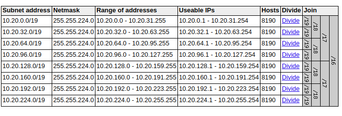

# **Start**EKS

Minimum set of terraform configurations to create an EKS cluster that is secure and reliable for common scenarios.

> This repository will give you a sane start of configurations to deploy K8s in AWS.


### TLDR
```bash
make test # to to check dependencies
```

```bash
make buildup # to provision the whole stack
```

```bash
make teardown # to destroy the whole stack
```

### How do i use this?
 The general steps are:


#### **First: AWS resources**
 - Create needed AWS resources in a specific AWS region, this directory contains the cloud infrastructure needed for usage of AWS EKS, this is provisioned using terraform.
- provision terraform dependencies
- provision EKS resources

**notes:** 
- EKS uses [Amazon VPC Container Network Interface](https://docs.aws.amazon.com/eks/latest/userguide/cni-custom-network.html) its important to provide enough ip ranges to allow for cluster resource to allocate ip addresses to appropriate availability zones mapping for availability.
  we will be using subnets with /19 CIDR, with 3 subnets only to map to 3 availability zones, per public and private config( top 3 entries will be private subnets and bottom 3 will be public).
  
- as a security measure of EKS, all EKS resources must be in a private subnets with private networking(in this repo the provided setup  exposes k8s API publicly)
- EKS security groups are very permissive for inter-cluster networking and might need to be reviewed
- Sate backend for terraform is configured to be s3, in this repo the versioning is disabled (and delete `force_destroy = true` ) which I recommend that it needs to be enabled for this repo when put in a real use case.

#### **Second: k8s Cluster Configurations**
- **Configure and setup AWS/IAM RBAC setup**
  - IRSA: IAM roles Service Accounts
  - Users access to K8s API
- **Setup Scheduling affinity and anti affinity roles**
  - Availability rules for AZs
- **AWS secret manager**
  - Integrate Secrets manager with EKS
- **Security Monitoring**
  - K8s logs
  - Services logging
- **Availaiblity monitoring**
  - Metrics, timeseries, and logging

### Tools and dependencies
- Terraform v0.13.3
- AWS VPC [official terraform module](https://github.com/terraform-aws-modules/terraform-aws-vpc)
- Terraform Aws Provider
  ```json
  {
    "registry.terraform.io/hashicorp/aws": {
      "version": "3.8.0"
    }
  }
  ```


### To Do
- ~~Create AWS IAM configs for service accounts~~
- ~~EKS encryption settings~~
- ~~fixed AWS provider version~~
- ~~fixed k8s/eks deployed version~~
- ~~Create Service account configuration inside k8s~~
- ~~Create makefile to manage the repo~~
- Configure Users/groups access to AWS Account
- Configure users and groups access to AWS EKS 
- Service mesh (istio vs aws mesh) L7 
- Calico network policies/ L4 services connectivity 
- Update KMS key policy
- Autoscaling of worker nodes
- Spot Instances for worker nodes
- Spot.io for worker nodes
- update read me about AWS credentials & AWS account number retreivals